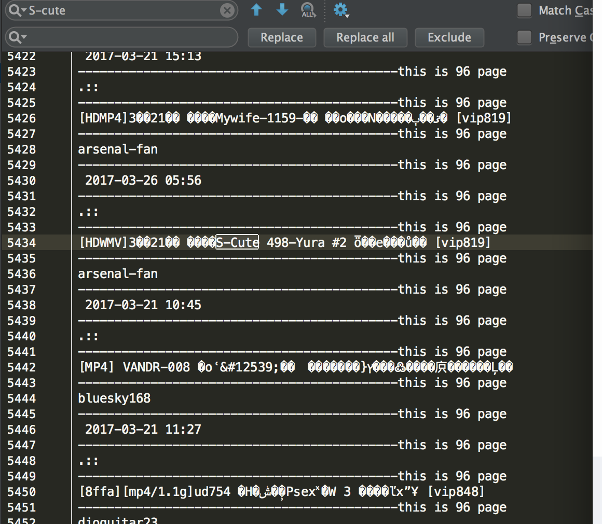

### 一个简单却很实用的1024记录工具

### 更新说明

* v1.0.0
* 如发现功能问题，或者网址失效问题请emailTo(php@autoc.cc)

* v1.0.1
* 覆盖最新地址，修复筛选参数bug，修复页码bug

### 功能说明

* 满足搜索到某个固定的有名号的资源（非老司机无法使用）
* 仅仅提供公用资源100页（如果有老司机愿意捐献账号，可以爬更多）
* 可满足速度调节（默认一分钟，请留一点资源贡献给所有人）

### 运行方式

CGI运行
``` php
php 1024.php
```

如果需要网站方式运行，请自行加入网站超时函数

### 结果截图

* 如果所示，后面是这个资源的页数，前面是资源名字，可使用系统自带的查找进行查询



### 完善说明

* 后续如果有账号可增加搜寻能力


